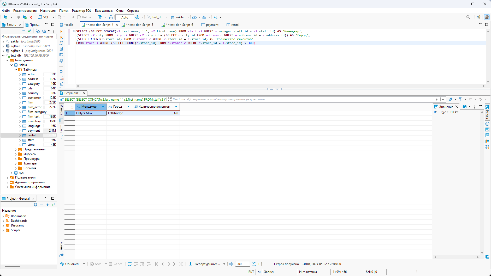
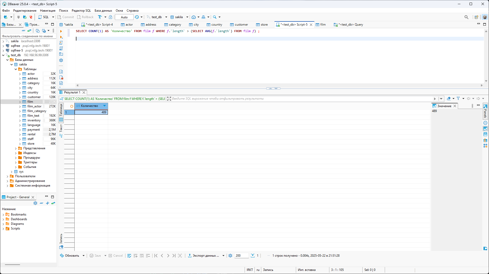
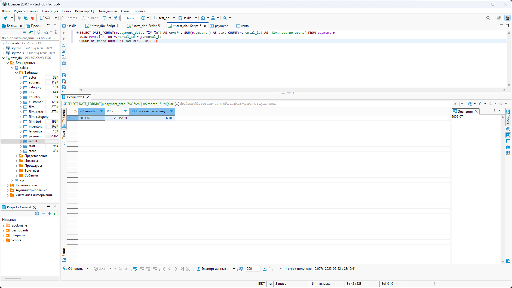

# Домашнее задание к занятию «SQL. Часть 2» - Плеханов С.А.

### Задание 1

Одним запросом получите информацию о магазине, в котором обслуживается более 300 покупателей, и выведите в результат следующую информацию: 
- фамилия и имя сотрудника из этого магазина;
- город нахождения магазина;
- количество пользователей, закреплённых в этом магазине.

### Решение 1

````SQL
SELECT (SELECT CONCAT(s2.last_name, ' ', s2.first_name) FROM staff s2 WHERE s.manager_staff_id = s2.staff_id) AS 'Менеджер',  
(SELECT c2.city FROM city c2 WHERE c2.city_id = (SELECT a.city_id FROM address a WHERE a.address_id = s.address_id)) AS 'Город', 
(SELECT COUNT(c.store_id) FROM customer c WHERE c.store_id = s.store_id) AS 'Количество клиентов'
FROM store s WHERE (SELECT COUNT(c.store_id) FROM customer c WHERE c.store_id = s.store_id) > 300
````


### Задание 2

Получите количество фильмов, продолжительность которых больше средней продолжительности всех фильмов.

### Решение 2

````SQL
SELECT COUNT(1) AS 'Количество' FROM film f WHERE f.`length` > (SELECT AVG(f.`length`) FROM film f) ;
````


### Задание 3

Получите информацию, за какой месяц была получена наибольшая сумма платежей, и добавьте информацию по количеству аренд за этот месяц.

### Решение 3

````SQL
SELECT DATE_FORMAT(p.payment_date, "%Y-%m") AS month , SUM(p.amount ) AS sum, COUNT(r.rental_id) AS 'Количеество аренд' FROM payment p 
JOIN rental r  ON r.rental_id = p.rental_id
GROUP BY month ORDER BY sum DESC LIMIT 1;
````



